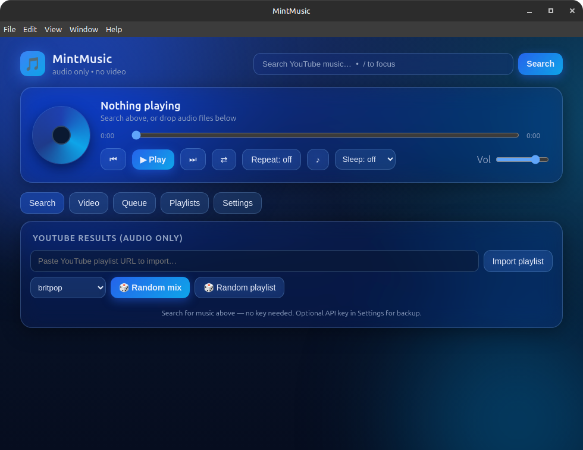

# MintMusic

Audio-first YouTube music player for Linux Mint. Dark-blue glassy desktop app (Electron) — search YouTube with **no API key**, build queues and playlists, import playlists, roll random mixes from UK genres.



## Install

```bash
npm install
npm start
```

`.deb` package:

```bash
npm run dist
sudo dpkg -i dist/mintmusic_*_amd64.deb
```

Requires: Node 20+. No API key needed for search, playback, or playlist import (uses keyless Innertube access with Piped fallback; an optional YouTube Data API key in Settings acts as backup).

## Features

- **Keyless YouTube search** — no signup, no quota; optional Data API key as backup
- **Audio-first playback** — hidden-video YouTube player + local audio files (`mp3/ogg/wav/flac/m4a`) in one shared queue
- **Queue** — reorder-free list with per-track remove, clear, shuffle, repeat off/all/one, seek bar, persistent volume
- **Playlists** — create/rename/delete, add any track, play whole list, stored locally
- **Playlist import** — paste any YouTube playlist URL (keyless, up to 500 tracks)
- **🎲 Random mix** — picks your selected genre + 2 related, queues ~15 shuffled tracks
- **🎲 Random playlist** — finds and imports a random playlist of the selected genre
- **18 UK genres** — britpop, UK garage, grime, drum and bass, UK hip hop, northern soul, madchester, shoegaze, UK folk, dubstep, jungle, 2-tone ska, trip hop, post-punk, UK indie, afroswing, UK drill, brit funk
- **Auto-skip broken tracks** — embed-blocked/deleted videos skip after 2.5s (stops after 3 in a row)
- **Radio mode** — when the queue ends, keeps playing from your last search results
- **Lyrics** — one-click lookup via lrclib.net in a glass modal
- **Sleep timer** — 5/15/30/60/90 min with countdown
- **History** — last 200 plays
- **Export** — queue to `.m3u`
- **Mint integration** — taskbar/task-tray icon, minimize-to-tray, optional close-to-tray, media keys (play/pause/next/prev/stop), desktop notifications
- **Shortcuts** — `Space` play/pause, `/` search, `←/→` seek 10s

## Notes

- YouTube embeds require a visible player (their rule since 2025), so video lives in its own **Video** tab — audio keeps playing on every other tab.
- Some label-owned videos block embedding; the app skips them and offers ↗ open-in-browser.
- No downloads/ripping — stream-only, ads play as audio.

## Files

| File | Purpose |
|---|---|
| `main.js` | windows, tray, media keys, keyless YouTube (Innertube) backend |
| `preload.js` | safe renderer bridge |
| `index.html` / `styles.css` / `renderer.js` | glass UI, queue, playlists, lyrics, timers |
| `assets/icon.png` | app/taskbar icon |
| `TECH_SPEC.md` | design notes |

## License

GPL-3.0-or-later.
